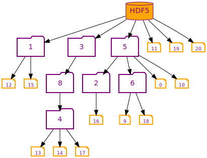

# **hdf5 object copy**
copies a tree of objects from one hdf5 into another. To generate random input please [check out this project](https://github.com/steven-varga/h5rnd)

## based on visitor pattern


```
/* from: https://portal.hdfgroup.org/display/HDF5/H5O_VISIT1
The parameters of this callback function have the following values or meanings:

obj	 - Object that serves as root of the iteration; same value as the H5Ovisit object_id parameter
name - Name of object, relative to o_id, being examined at current step of the iteration
info - H5O_info2_t struct containing information regarding that object
op_data - User-defined pointer to data required by the application in processing the object; a pass-through of the op_data pointer provided with the H5Ovisit_by_name function call

Information struct for object (For H5Oget_info/H5Oget_info_by_name/H5Oget_info_by_idx versions 1 & 2)
typedef struct H5O_info1_t {
    unsigned long  fileno;    File number that object is located in
    haddr_t        addr;      Object address in file
    H5O_type_t     type;      H5O_TYPE_DATASET | H5O_TYPE_GROUP | H5O_TYPE_NAMED_DATATYPE |H5O_TYPE_NTYPES | H5O_TYPE_UNKNOWN 
    unsigned       rc;        Reference count of object
    time_t         atime;     Access time
    time_t         ctime;     Change time
    time_t         btime;     Birth time
    hsize_t        num_attrs; # of attributes attached to object
    H5O_hdr_info_t hdr;       Object header information
    # Extra metadata storage for obj & attributes
    struct {
        H5_ih_info_t obj;  # v1/v2 B-tree & local/fractal heap for groups, B-tree for chunked datasets
        H5_ih_info_t attr; # v2 B-tree & heap for attributes
    } meta_size;
}
*/

```

## [property list](http://sandbox.h5cpp.org/architecture/#object-copy-property-list) manipulation
```
auto ocpl = h5::shallow_hierarchy | h5::expand_soft_link | h5::expand_ext_link |
    h5::expand_reference | h5::copy_without_attr | h5::merge_commited_dtype;
```




# requirements:

- [h5cpp v1.10.6-1](http://h5cpp.org)
- [argparse](https://github.com/p-ranav/argparse)  included with this project
- HDF5 C base library, no high level API or beuilt in C++ API is needed works with:  `serial|parallel`
- c++17 or higher compiler
